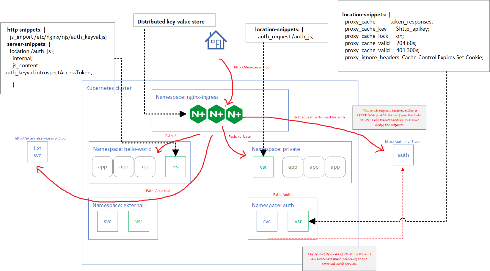

# nginx-auth-plus-externalname-advanced
Demo app for NGINX Plus Ingress Controller features. **This is an advanced version** of the use case covered in a [previous demo](https://github.com/mikeoleary/nginx-auth-plus-externalname). 

# Background
This repo contains files for a PoC to demonstrate the following requirements from NGINX Plus Ingress Controller
1. **Authentication subrequests**. This allows access to a given path [based on the result of a subrequest](https://docs.nginx.com/nginx/admin-guide/security-controls/configuring-subrequest-authentication/) to an authentication service. We will protect the location ```/private``` with an authorization service that will return a 204 or a 401 response.
2. **ExternalName service**. This [has been supported](https://www.nginx.com/blog/announcing-nginx-ingress-controller-for-kubernetes-release-1-5-0/#ExternalName) since NGINX Ingress Controller 1.5 and is a Plus-only feature. Offical example from NGINX documentation is [here](https://github.com/nginxinc/kubernetes-ingress/tree/main/examples/custom-resources/externalname-services).
3. **HTTP Header append and remove**. This is straightforward functionality to append or remove headers from requests to proxied upstream servers. We will use the native functionality of the [VirtualServer and VirtualServerRoute](https://docs.nginx.com/nginx-ingress-controller/configuration/virtualserver-and-virtualserverroute-resources/) Custom Resource Definitions.
4. **Caching to disk**.
5. **Distributed caching using the key-value store**.
6. **Deletion from the key-value store using REST API**.

# Prerequisites
1. **Auth service**. This can be inside or outside of the cluster. Typically, it is external to the cluster. In this demo I have set up an internet-reachable service that is extremely simple: it responds to every HTTP request with a 204 (success). I can manually change this to respond with a 401 (failed). When the NGINX Ingress Controller makes a request to this service, the response (either a 204 or a 401) will tell NGINX to allow or disallow the request, respectively.
2. **External service**. It may help to set up an external service that is capable of receiving HTTP requests on your expected port (80 or 443) as well as capable of receiving HTTP requests with the hostname you are planning to use.
3. **NGINX Plus JWT or cert and key**. You will need a way to pull or build the NGINX Plus Ingress Controller image. Personally I like to use a JWT token and K8s secret to pull the image from private-registry.nginx.com, as described [here](https://docs.nginx.com/nginx-ingress-controller/installation/using-the-jwt-token-docker-secret/). So I'll be assuming that method in this example.
4. **Network ingress to NGINX Ingress Controller**. This lab doesn't cover how to get traffic into your K8s cluster. You must be able to expose the NGINX Ingress Controllers to network traffic yourself. Personally, I like to use F5 BIG-IP's and CIS like I do in [this lab I commonly use](https://github.com/mikeoleary/azure-aks-kic-cis/). In any case, this lab assumes you're able to hit your NGINX Ingress Controller pod as described in the architectural overview.

# Overview of lab architecture



